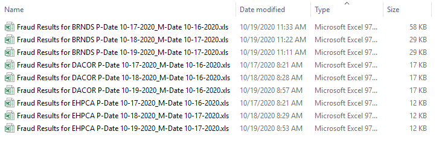
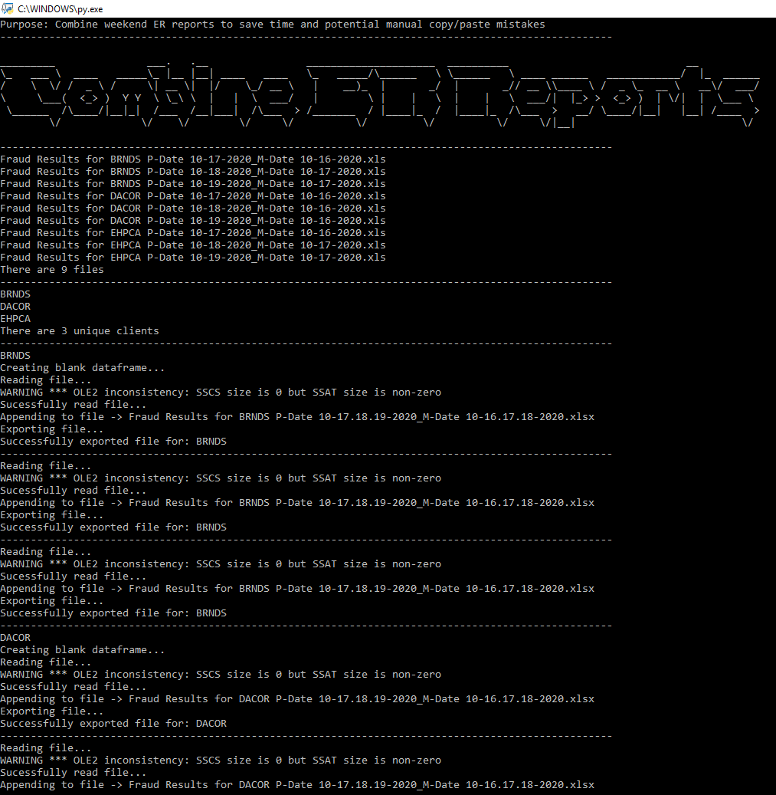
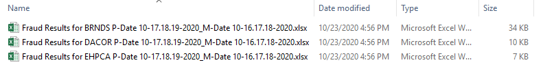
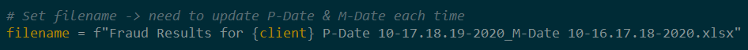

# Combine-ER-Reports

Purpose: Combine (append) weekend ER reports to save time and potential manual copy/paste mistakes.

## Why Important

After weekends, we work the reports that were run on the weekend as well as current day. Therefore we combine (append) all files and work mutiple days as 1 file.

Combining the files (usually 30-35 files) is a time consuming menial task with lots of room for manual copy/paste errors and something my work team needs to do on a regular basis (usually every Monday).

Time saved using this script is around 20-25 minutes.

## Installation

Use the package manager [pip](https://pip.pypa.io/en/stable/) to install respective libraries.

```bash
pip install pandas
pip install numpy
pip install glob
pip install openpyxl
```

## Usage

Put all raw ER report files (.xls) into directory User/Desktop/python_projects/combine_er_reports/data/raw



Run the script



Combined files (.xlsx) will be exported to directory User/Desktop/python_projects/combine_er_reports/data/exports



## Error Messages

The script prints out an error message when run:

```python
"WARNING *** OLE2 inconsistency: SSCS size is 0 but SSAT size is non-zero"
```

This is due to importing .xls files and exporting as .xlsx and seems to be an issue with working with unicode characters.

It does not appear to affect the files or their data and is acceptable at this time.

xls seems to use the UTF-16 file format while xlsx using UTF-8, hence the inconsistency format warning message.

For testing I used .xlsx to import and did not receive this error message when running the script.

## Possible Future Improvements

At this time, it is still a manual process to manually rename the dates for the exported file(s). We may have more than 3 days to combine (holidays etc) so it is still easiest to keep manual. 



## Contributing

I was helped immensely by https://github.com/Fehiroh who walked me through the logic and thought process of the script (originally done in R/tidyverse). I then re-worked the script into Python/Pandas using the same logic. 
